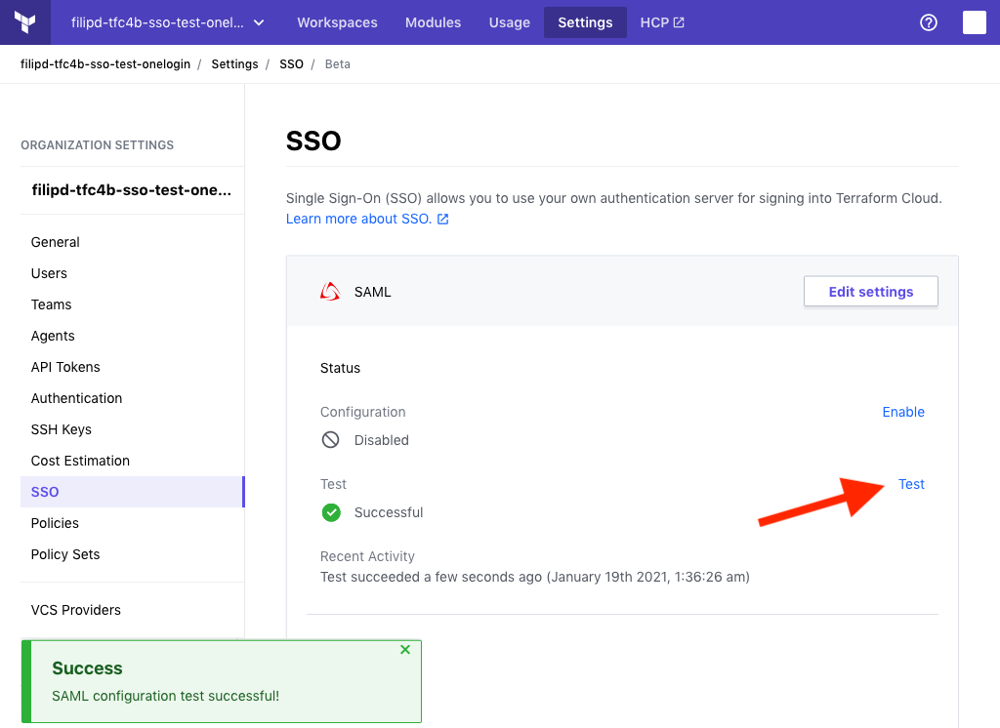

-> **Note:** Single sign-on is a paid feature, available as part of the **Business** upgrade package. [Learn more about Terraform Cloud pricing here](https://www.hashicorp.com/products/terraform/pricing/).

# Single Sign-on: SAML / OneLogin

The SAML SSO integration currently supports the following SAML features:

- Service Provider (SP)-initiated SSO
- Identity Provider (IdP)-initiaited SSO
- Just-in-Time Provisioning

## Configuration

1. Sign in to OneLogin - https://app.onelogin.com/login
2. *(optional, if you are not already in the Admin panel)* Go to the Admin panel by clicking on "Administration"

    

3. From the Applications tab, select "Applications"

    

4. Click on "Add App"

    

5. In the Search field, type "SAML Test Connector (Advanced)" and select it from the list

    

6. Choose a "Display name" for the connection (for example: "Terraform Cloud") and click on "Save"

    

7. Click on "More Actions", right-click/control-click on "SAML Metadata" and choose "Copy Link Address / Copy Link Location" (or similar)

    

8. Sign in to Terraform Cloud - https://app.terraform.io/session
9. Select the required Terraform Cloud for Business Organization (optional step, in case your user is part of more than one organization)

10. Click on "Settings", "SSO", "Setup SSO"

    

11. Select SAML and click "Next"

    

12. Paste the contents of the previous OneLogin step (the SAML Metadata URL) into the "Metadata URL (required)" field in Terraform Cloud, click on "Save settings" in the bottom right corner of the page.

    

13. *(optional)* Enter `^https:\/\/app.terraform.io\/sso\/saml.*` in the "ACS (Consumer) URL Validator" field in the "Configuration" tab in OneLogin

    

14. Copy the "Assertion Consumer URL" from Terraform Cloud to "Recipient" and "ACS (Consumer) URL" fields in the "Configuration" tab in OneLogin and click "Save" in the top right corner.

    
    

    ~> **Important:** Make sure that your OneLogin user has access to the application (either by explicitly adding it to the application or via roles)

15. Click the "Test" button in Terraform Cloud
    

16. Click the "Enable" button in Terraform Cloud
    

17. Confirm the enablement of SAML SSO
    

-> **Note:** You should now be able to login into Terraform Cloud by clicking on the application in OneLogin or by visiting the SSO Sign-in page - https://app.terraform.io/sso/sign-in 

## Team Mapping Configuration (OneLogin)

Terraform Cloud can automatically add users to teams based on their SAML assertion, so you can manage team membership in your directory service. To do this, you must specify the `MemberOf` SAML attribute, and make sure the AttributeStatement in the SAML Response contains a list of AttributeValue items in the correct format (i.e., comma-separated list of team names). For additional details on this and other SSO concepts within the context of Terraform Cloud, please refer to [this](../single-sign-on.html) overview page.
